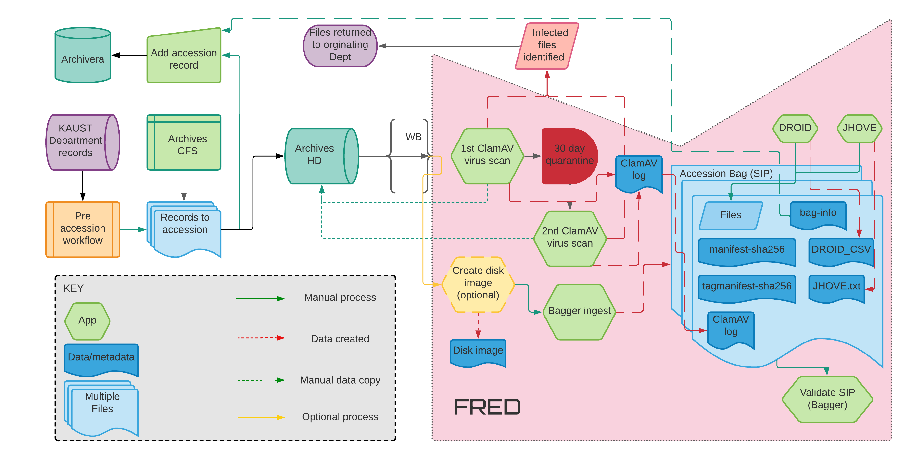

Clamdock
========

Digital preservation workflow with Docker.

# Introduction



Automate the digital preservation workflow. 

The workflow have the following steps:

1. Run the antivirus.
1. Create a _bag_ file from the source folders.
1. Create a XML file Dublin Core.
1. Run Droid for extraction of the metadata.
1. Run JHove as a complement of the metadata.

Next we describe the usage of the script, and the installation of dependencies are below

# Running

Running the script:

1. Activate the virtual environment.
1. Edit the configuration file with the details of the items that will be exported to Libnova.
    * The accession number: `accession_id = 000_000_0000`
    * The source directory: `source_dir = C:\Users\garcm0b\Work\clamdock_data\src\test01`
    * The destination directory: `dest_dir = C:\Users\garcm0b\Work\clamdock_data\dest\${ACCESSION:accession_id}`. Note that the accession number is used to name the destination directory.
1. Run the python script.

Something like this:

```
# Activate the virtual environment
. .\venv\Scripts\activate

# Edit the configuration file
cp 000_000_0000.cfg_example <you_name_here>.cfg
<edit your config file>

# Run the script
python .\run_dock.py .\000_000_0000.cfg
```

# Configuration

The configuration needs to be done only once.

# ClamAV Container

## Input File

Copy the provided example configuration file to the actual file and modidy it as needed, like setting the correct path to the files

```
mgarcia@ilmen:~/Work/clamdock$ cp 000_000_0000.cfg_example 000_000_0000.cfg
```

Example of input file

```
#
# Configuration file for the digital preservation workflow
#

# Maybe this only make sense for Linux users, and on Windows
# just remove it.
[USER]
uid = 1000
gid = 1000

[ACCESSION]
accession_id = 000_000_0000

[BAGGER]
# You can specify a comma separated list of directories as source: dir1, dir2, ...
source_dir = /home/mgarcia/Work/clamdock_data/src/libguides
# Using Python ExtendedInterpolation to use the 'accession_id' as target directory
dest_dir = /home/mgarcia/Work/clamdock_data/dest/${ACCESSION:accession_id}
# TODO: This comment below must be verified!
# If 'false' the script will stop the the destination directory already exists.(?)

[CLAMAV]
av_logs_root = /home/mgarcia/Work/clamdock_data/logs
#
# TODO: Check if directory exists.
# For the moment, it has to be created by hand - but only the
# first time
quarantine_dir = /home/mgarcia/Work/clamdock_data/quarantine
quarantine_file = ${quarantine_dir}/${ACCESSION:accession_id}
quarantine_days = 30
#
# TODO: Check if the volume exists.
# For the moment it has to be created by hand - only the first time.
av_volume = clamdb

[DROID]
# The profile is the database with the metadata in binary format.
keep_profile = yes

[JHOVE]
jhove_xml = yes

[JHOVE MODULES]
AIFF-hul     = no
ASCII-hul    = no
GIF-hul      = no
GZip-kb      = no
HTML-hul     = no
JPEG-hul     = yes
JPEG2000-hul = yes
PDF-hul      = no
TIFF-hul     = no
UTF8-hul     = no
WARC-kb      = no
WAVE-hul     = no
XML-hul      = no
```

## Persisting the Virus Database

Creating a volume for [persisting the virus database](https://docs.clamav.net/manual/Installing/Docker.html#persisting-the-virus-database-volume):

```
a-garcm0b@library-docker-test:~/Work/clamdock/airflow$ docker volume create clamdb
clamdb
a-garcm0b@library-docker-test:~/Work/clamdock/airflow$
```

## Update Virus Database

Next we update the virus database

```
# Linux
docker run -it --rm \
--name 'freshclamdb' \
--mount source=clamdb,target=/var/lib/clamav \
clamav/clamav:latest freshclam
```

## Scanning a Folder

Running the ClamAV container directly from command line as test.

The container will mount the local file system with mount _bind_.

Running from command line. Interestingly when there is a space in the path, docker only works with `-v` option

```
docker run  --rm --name clam_test `
-v 'C:\Users\garcm0b\Downloads\autoarchive\2018batch\Image_Files\Image Files\Heno:/scandir' `
-v 'C:\Users\garcm0b\Downloads\Work_Test:/log' `
clamav/clamav:latest clamscan /scandir  `
--verbose  --recursive=yes `
--log=/log/test.txt
Starting Freshclamd
Starting ClamAV
(...)
```

# Copy Container

Using a container to copy files for the bagIt folder

```
PS C:\Users\garcm0b\Work> docker run -it --rm --name cp_test `
>> -v "C:\Users\garcm0b\OneDrive - KAUST\Pictures\social_hour:/src" `
>> -v "C:\Users\garcm0b\Work\test_cp_container:/dest" `
>> debian:bookworm-slim cp -pr /src /dest
PS C:\Users\garcm0b\Work>
```

# BagIt

## Building

Build the container image using the `Dockerfile.bagit`

```
PS C:\Users\mgarcia\Work\clamdock> docker build -f Dockerfile.bagit -t mybagit .
[+] Building 3.0s (6/6) FINISHED
docker:default
 => [internal] load .dockerignore                                0.0s
 => => transferring context: 2B
 (...)
```

## Running

After building the container, you will need to create a file with environment variables used by the `bagit`

```
mgarcia@arda:~/Work/clamdock$ cat bagit_env
SOURCE_ORGANIZATION="KAUST"
EXTERNAL_IDENTIFIER="Hello"
INTERNAL_SENDER_DESCRIPTION="internal description"
TITLE="Testing bagit"
DATE_START="2024-03-21"
RECORD_CREATORS="Creator"
RECORD_TYPE="rec_type"
EXTEND_SIZE="123456"
SUBJECTS="Subject"
OFFICE="Office"
mgarcia@arda:~/Work/clamdock$
```

Then you run the container to create the _bag_

```
mgarcia@arda:~/Work/clamdock$ docker run -it --rm --env-file bagit_env \
-v "/home/mgarcia/Work/clamdock_data/mybag:/mydir" \
--name mgbagit mybagit bagit.py --contact-name 'john' /mydir
mgarcia@arda:~/Work/clamdock$
```

Checking the _bag_

```
mgarcia@arda:~/Work/clamdock_data/mybag$ cat bag-info.txt
Bag-Software-Agent: bagit.py v1.8.1 <https://github.com/LibraryOfCongress/bagit-python>
Bagging-Date: 2024-09-09
Date-Start: "2024-03-21"
Extend-Size: "123456"
External-Identifier: "Hello"
Internal-Sender-Description: "internal description"
Office: "Office"
Payload-Oxum: 607.3
Record-Creators: "Creator"
Record-Type: "rec_type"
Source-Organization: "KAUST"
Subjects: "Subject"
Title: "Testing bagit"
mgarcia@arda:~/Work/clamdock_data/mybag$
```

# Jhove

Installing Jhove on the container

```
PS C:\Users\garcm0b\Work\clamdock> docker run -it --rm -v "C:\Users\garcm0b\Work\clamdock\files:/work" --name jhove ibmjava
root@2e4e123483a9:/work# java -jar jhove-latest.jar auto-install.xml
root@2e4e123483a9:/opt/jhove# ./jhove
Jhove (Rel. 1.28.0, 2023-05-18)
 Date: 2023-08-14 06:39:56 GMT
 App:
  API: 1.28.0, 2023-05-18
  Configuration: /opt/jhove/conf/jhove.conf
(...)
```

Or building, and running, our own container with Jhove

```
PS C:\Users\garcm0b\Work\clamdock> docker build -f Dockerfile.jhove -t myjhove .
PS C:\Users\garcm0b\Work\clamdock> docker run -it --rm -v 'C:\Users\mgarcia\Documents:/myfiles' --name mgjhove myjhove -m PDF-hul /myfiles/2020.nlpcovid19-acl.1.pdf
Jhove (Rel. 1.28.0, 2023-05-18)
 Date: 2023-08-25 14:54:58 GMT
 RepresentationInformation: /myfiles/2020.nlpcovid19-acl.1.pdf
  ReportingModule: PDF-hul, Rel. 1.12.4 (2023-03-16)
  LastModified: 2022-04-07 18:56:01 GMT
  Size: 3536281
  Format: PDF
  Version: 1.5
  Status: Well-Formed and valid
  (...)
```

# DROID

## Prequisite

Download Java JRE first. Note that the version of DROID may require an update of Java as mentioned in this remark: DROID 6.8.1 requires Java 21. We will use [Amazon Java](https://hub.docker.com/_/amazoncorretto) to build the container.

```
mgarcia@PC-KL-26743:~/Work/clamdock$ docker pull amazoncorretto:21.0.8-al2
```

Next download [DROID](https://www.nationalarchives.gov.uk/information-management/manage-information/preserving-digital-records/droid/) for all platforms (instead of the Windows version), and extract the archive into the _files_ directory

```
PS C:\Users\mgarcia\Downloads> expand-Archive -path '.\droid-binary-6.6.1-bin.zip' -destination 'C:\Users\mgarcia\Work\clamdock\files\droid' (Windows)
# *or*
mgarcia@PC-KL-26743:~/Downloads$ unzip droid-binary-6.8.1-bin.zip -d ~/Work/clamdock/files/droid/ (Linux/WSL)
```

Building the container

```
PS C:\Users\mgarcia\Work\clamdock> docker build -f Dockerfile.droid -t mydroid . (Powershell)
# *or*
mgarcia@PC-KL-26743:~/Work/clamdock$ docker build -f Dockerfile.jhove -t myjhove . (Linux/WSL)
```

Running the DROID contaner

```
PS C:\Users\mgarcia\Downloads> docker run -it --rm -v 'C:\Users\mgarcia\Documents\Sparkasse\:/mydata' --name mgdroid mydroid -a /mydata --recurse
"ID","PARENT_ID","URI","FILE_PATH","NAME","METHOD","STATUS","SIZE","TYPE","EXT","LAST_MODIFIED","EXTENSION_MISMATCH","HASH","FORMAT_COUNT","PUID","MIME_TYPE","FORMAT_NAME","FORMAT_VERSION"
"1","","file:/mydata/","/mydata","mydata","","Done","","Folder","","2023-08-25T11:05:54","false","","","","","",""
"2","1","file:/mydata/20211021_Deka_Kauf_von_Wertpapieren.PDF","/mydata/20211021_Deka_Kauf_von_Wertpapieren.PDF","20211021_Deka_Kauf_von_Wertpapieren.PDF","Signature","Done","83206","File","pdf","2021-10-31T14:47:49","false","","1","fmt/354","application/pdf","Acrobat PDF/A - Portable Document Format","1b"
(...)
```

Saving the profile. It seems this step is necessary to convert the profile to a CSV file later.

Creating the profile

```
(clamdock) PS C:\Users\garcm0b\Work\clamdock> docker run -it --rm `
>> -v "C:\Users\garcm0b\Work\clamdock_data\000_000_0000:/mydata" `
>> --name mgdroid mydroid -a /mydata --recurse -p /mydata/test.droid
2024-01-02T14:42:45,245  INFO [main] DroidCommandLine:225 - Starting DROID.
2024-01-02T14:42:46,891  INFO [main] ProfileManagerImpl:129 - Creating profile: 1704206566890
(...)
```

Next we export the profile to CSV

```
(clamdock) PS C:\Users\garcm0b\Work\clamdock> docker run -it --rm `
>> -v "C:\Users\garcm0b\Work\clamdock_data\000_000_0000:/mydata" `
>> --name mgdroid mydroid -p /mydata/test.droid -e /mydata/test.csv
2024-01-02T14:45:20,788  INFO [main] DroidCommandLine:225 - Starting DROID.
2024-01-02T14:45:22,563  INFO [main] ProfileManagerImpl:396 - Loading profile from: /mydata/test.droid
2024-01-02T14:45:26,012  INFO [pool-2-thread-1] ExportTask:187 - Exporting profiles to: [/mydata/test.csv]
(...)
```

Checking the CSV

```
PS C:\Users\garcm0b\Work\clamdock_data\000_000_0000> more .\test.csv
"ID","PARENT_ID","URI","FILE_PATH","NAME","METHOD","STATUS","SIZE","TYPE","EXT","LAST_MODIFIED","EXTENSION_MISMATCH","HASH","FORMAT_COUNT","PUID","MIME_TYPE","FORMAT_NAME","FORMAT_VERSION"
"2","","file:/mydata/","/mydata","mydata","","Done","","Folder","","2024-01-02T12:31:26","false","","","","","",""
"4","2","file:/mydata/bag-info.txt","/mydata/bag-info.txt","bag-info.txt","Extension","Done","399","File","txt","2024-01-02T12:31:26","false","","1","x-fmt/111","text/plain","Plain Text File",""
(...)
```
