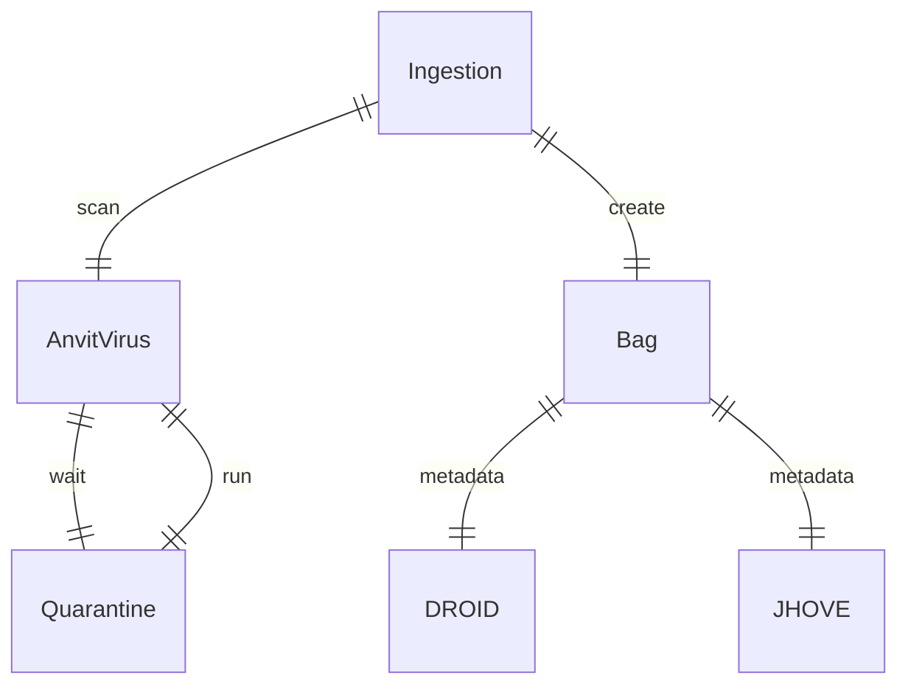
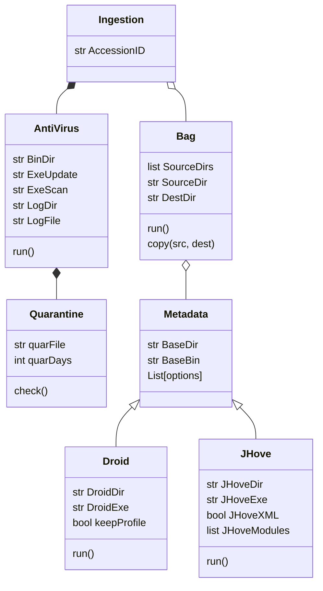

# Clamdock

 Running ClamAV inside Docker

## ER Diagram



## Class Diagram




## Running Container

Running the ClamAV container directly from command line as test.

The container will mount the local file system with mount _bind_.

Running from command line. Interestingly when there is a space in the path, docker only works with `-v` option

```
docker run  --rm --name clam_test -v 'C:\Users\garcm0b\Downloads\autoarchive\2018batch\Image_Files\Image Files\Heno:/scandir' -v 'C:\Users\garcm0b\Downloads\Work_Test:/log' clamav/clamav:latest clamscan /scandir  --verbose  --recursive=yes  --alert --log=/log/test.txt
Starting Freshclamd
Starting ClamAV
(...)
```

## Jhove

Installing Jhove on the container

```
PS C:\Users\garcm0b\Work\clamdock> docker run -it --rm -v "C:\Users\garcm0b\Work\clamdock\files:/work" --name jhove ibmjava
root@2e4e123483a9:/work# java -jar jhove-latest.jar auto-install.xml
root@2e4e123483a9:/opt/jhove# ./jhove
Jhove (Rel. 1.28.0, 2023-05-18)
 Date: 2023-08-14 06:39:56 GMT
 App:
  API: 1.28.0, 2023-05-18
  Configuration: /opt/jhove/conf/jhove.conf
(...)  
```

Or building, and running, our own container with Jhove

```
PS C:\Users\garcm0b\Work\clamdock> docker build -f Dockerfile.jhove -t myjhove .
PS C:\Users\garcm0b\Work\clamdock> docker run -it --rm --name jhove myjhove 
Jhove (Rel. 1.28.0, 2023-05-18)
 Date: 2023-08-14 07:33:30 GMT
 App:
  API: 1.28.0, 2023-05-18
(...)  
```
