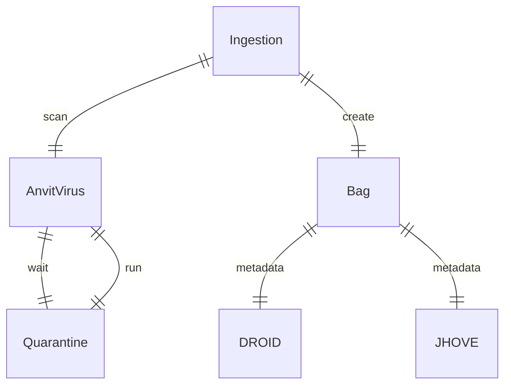
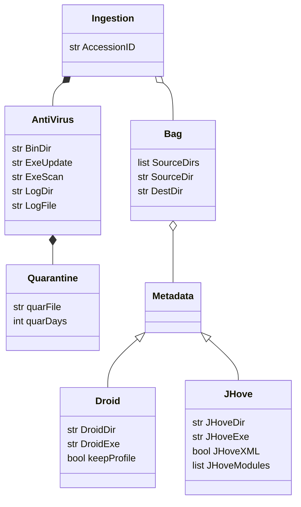

# Clamdock

 Running ClamAV inside Docker

## ER Diagram



## Class Diagram



## Running Container

Running the ClamAV container directly from command line as test.

The container will mount the local file system with mount _bind_.

Running from command line. Interestingly when there is a space in the path, docker only works with `-v` option

```
docker run  --rm --name clam_test -v 'C:\Users\garcm0b\Downloads\autoarchive\2018batch\Image_Files\Image Files\Heno:/scandir' -v 'C:\Users\garcm0b\Downloads\Work_Test:/log' clamav/clamav:latest clamscan /scandir  --verbose  --recursive=yes  --alert --log=/log/test.txt
Starting Freshclamd
Starting ClamAV
(...)
```
